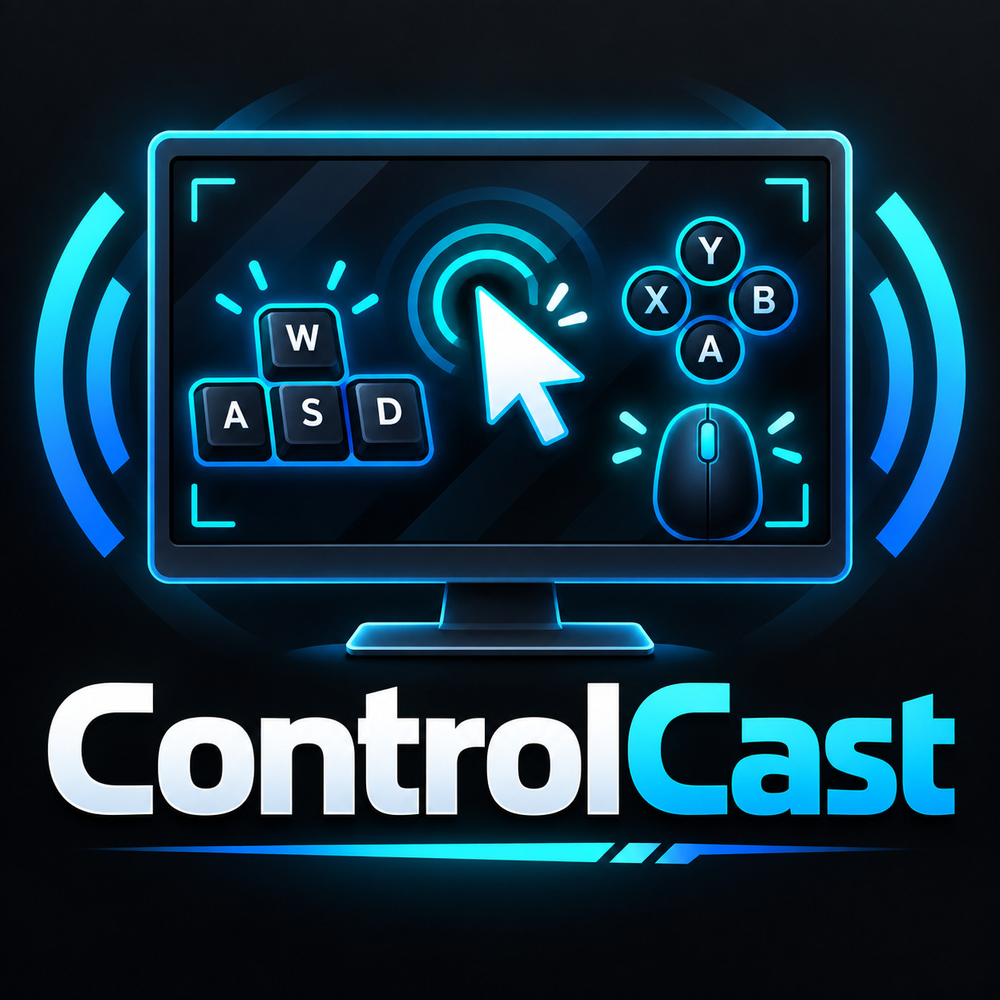

# ControlCast – Custom Reactive Input Visuals for OBS

  

**Create fully custom mouse, keyboard, controller, and hotkey visuals that react live to your inputs.**

**Your inputs. Your design. Your stream.**

## Teaser Video

See ControlCast in action before the full tutorial series is released.

[Watch on TikTok](https://www.tiktok.com/@akinraze/video/7688072716196252941?is_from_webapp=1&sender_device=pc)

[Watch on YouTube Shorts](https://www.youtube.com/shorts/TX3y3MifFT0)

---

## Follow Along With the Tutorial

Want to build the same ControlCast examples shown in the tutorial?

Download the **exact project artwork used in the videos** so your OBS setup can follow along with the same source material.

### MouseCast Project Files — SteelSeries Prime Wireless

Includes the SteelSeries Prime Wireless base image plus the individual overlay graphics used for:

- Left Click
- Right Click
- Wheel Down
- Front Side Button
- Rear Side Button

**[Download MouseCast Project Files](https://github.com/Akinraze/ControlCast/releases/download/v4.0.0/MouseCast.Project.Files.zip)**

### InputCast Project Files — Razer Tartarus V2

Includes the Razer Tartarus V2 base image and organized individual control overlays for:

- Row 1
- Row 2
- Row 3
- Row 4
- Thumb-control area

**[Download InputCast Project Files](https://github.com/Akinraze/ControlCast/releases/download/v4.0.0/InputCast.Project.Files.zip)**

> These packs are provided as tutorial follow-along assets. You are still free to build ControlCast layouts using your own devices, artwork, Sources, Groups, and designs.

---

## What You Need

### Required

- **OBS Studio** — ControlCast runs inside OBS and uses OBS Sources, Groups, Hotkeys, and Python scripting.
- **Python 3.12.7 64-bit (Windows)** — the recommended and confirmed working Python version for the current Windows builds.
- **A ControlCast module** — use MouseCast, InputCast, or both depending on the visual you want to build.

### Optional / Used in the Tutorial

- **Image-editing software** — GIMP is used in the tutorial examples, but it is **not required**.
- Any capable image editor is suitable if it can:
  - create or preserve transparent backgrounds
  - export transparent PNG images
  - make precise selections with tools such as a lasso, magic wand, or similar selection tools
  - crop, resize, and layer images as needed
- **Tutorial Project Files** — the supplied SteelSeries Prime Wireless and Razer Tartarus V2 artwork lets you follow along using the same example assets shown in the tutorial.

The tutorial videos will walk through installation, configuration, artwork preparation, OBS setup, and ControlCast configuration step-by-step.

---

ControlCast is a free OBS Python toolkit for building custom reactive on-screen controls from your own OBS Sources, Groups, and graphics.

There are no required layouts, image styles, naming conventions, or asset folders. Build something realistic, minimal, over-the-top, or completely absurd.

---

## Current Modules

### MouseCast v4.0

**MouseCast** is the dedicated mouse-visualization module.

It supports:

- Physical Left Click and Right Click detection
- 0–20 additional programmable inputs
- Extra-input numbering from `[01]` through `[20]`
- Direct shortcut assignment
- Modifier combinations
- Modifier-only inputs
- OBS Hotkey integration
- Named profiles
- Live profile switching without restarting OBS
- Profile-specific source assignments
- Profile-specific extra-input count
- Setup / Preview Mode
- Reactive mouse movement
- Separate horizontal and vertical movement ranges
- Sensitivity controls
- Follow and return behavior
- Permanent rest position per profile
- Movement safety that operates on an OBS Group
- Group-only movement target selection
- Automatic JSON profile storage
- Startup self-check and diagnostics

#### MouseCast files

**Windows production build**

`MouseCast_Windows_v4_0.py`

**macOS Community Test / RC1**

`MouseCast_macOS_v4_0_RC1.py`

---

### InputCast v4.0

**InputCast** is the general reactive-input module.

It links programmable inputs to OBS Sources so graphics or other assigned Sources react while the selected input is active.

It supports:

- 5–65 programmable inputs
- Input-count choices in increments of 5
- Keyboard inputs
- Mouse inputs through OBS Hotkeys
- Controller inputs through OBS Hotkeys
- Keypad and other OBS-supported hotkeys
- Direct shortcut assignment
- Modifier combinations
- Modifier-only inputs
- Stable numbered inputs
- Automatic OBS Source → Hotkey naming
- OBS Groups and nested Groups
- Shared-source reference counting
- Optional inverted behavior
- Master enable / disable
- Setup / Preview Mode
- Named profiles
- Live profile switching without restarting OBS
- Profile-specific input counts
- Profile-specific source assignments
- Profile-specific shortcut assignments
- Saved hotkey bindings
- Automatic JSON profile storage
- Startup self-check and diagnostics

#### InputCast files

**Windows production build**

`InputCast_Windows_v4_0.py`

**macOS Community Test / RC1**

`InputCast_macOS_v4_0_RC1.py`

---

## Platform Status

| Platform | MouseCast | InputCast | Status |
| --- | --- | --- | --- |
| Windows | `MouseCast_Windows_v4_0.py` | `InputCast_Windows_v4_0.py` | **Production** |
| macOS | `MouseCast_macOS_v4_0_RC1.py` | `InputCast_macOS_v4_0_RC1.py` | **Community Test / RC1** |

The Windows builds have been tested and refined directly during development.

The macOS builds are available for community testing but have **not yet been validated on physical Mac hardware**.

---

## Windows Requirements

ControlCast was developed and tested with:

- **OBS Studio 32.2.2**
- **Python 3.12.7 64-bit**
- Windows 11

Python **3.12.7 64-bit** is the recommended version for the current Windows builds.

During development, Python 3.13.x did not work correctly with this OBS Python scripting setup.

---

## macOS Testing Status

The macOS builds use macOS-specific input handling and are currently considered **Community Test / RC1**.

Mac users are invited to test and report:

- macOS version
- OBS Studio version
- Python version
- MouseCast Left / Right Click detection
- MouseCast movement behavior
- extra-input behavior
- InputCast hotkey behavior
- modifier-only behavior
- profile creation and switching
- JSON profile restore behavior
- any Accessibility or Input Monitoring permissions required
- relevant OBS Script Log output

Please do not assume the macOS files are production-ready until real-hardware testing confirms them.

---

## Installation

### 1. Install OBS Studio

ControlCast runs inside OBS Studio.

### 2. Install Python

For the tested Windows setup, use:

**Python 3.12.7 64-bit**

### 3. Point OBS to Python

In OBS:

**Tools → Scripts → Python Settings**

Select the installed Python directory.

### 4. Add a ControlCast script

In OBS:

**Tools → Scripts → +**

Choose the ControlCast module for your operating system.

For Windows:

- `MouseCast_Windows_v4_0.py`
- `InputCast_Windows_v4_0.py`

For macOS community testing:

- `MouseCast_macOS_v4_0_RC1.py`
- `InputCast_macOS_v4_0_RC1.py`

---

## MouseCast Setup Notes

MouseCast treats physical Left Click and Right Click as built-in mouse controls.

The optional programmable inputs are counted separately:

- `[01]` = first optional extra input
- `[02]` = second optional extra input
- continuing through `[20]`

Use **Extra Inputs to Show (0–20)** to display only the number of programmable inputs your mouse or layout actually needs.

Examples include:

- side buttons
- wheel-click actions
- large-button gaming mice
- keyboard shortcuts used as part of a mouse visual
- OBS Hotkeys

### Mouse movement

MouseCast moves the selected **OBS Group**, not an individual button image.

For movement:

1. Put the complete mouse visual inside an OBS Group.
2. Select the correct OBS Scene.
3. Select that mouse Group.
4. Leave movement OFF while arranging the mouse.
5. Place the Group at its desired resting position.
6. Enable mouse movement.

That position becomes the profile's rest position.

---

## InputCast Setup Notes

InputCast is designed for layouts that may need anything from a few inputs to a large control display.

Choose the input count needed by the current profile:

`5, 10, 15, 20 ... up to 65`

Each profile can have its own input count, source assignments, shortcut assignments, modifier settings, and saved hotkey bindings.

InputCast can be used for much more than game controls, including:

- editing software shortcuts
- OBS controls
- GIMP shortcuts
- Blender shortcuts
- DaVinci Resolve shortcuts
- tutorial overlays
- scene/source demonstrations
- controller layouts
- custom keypad layouts

---

## Profiles

Both MouseCast and InputCast support named profiles.

Profiles are useful when the same ControlCast installation is used for multiple games, devices, programs, or tutorials.

Profile actions include:

- Save current
- Create blank
- Duplicate
- Reset selected profile to blank
- Delete selected profile

Profiles can be switched while OBS is running or recording.

### OBS Scripts-panel refresh note

OBS applies profile changes immediately, but the open Python properties panel does not always visually rebuild itself.

After changing profiles, creating a profile, deleting a profile, resetting one, or changing a displayed-input count:

- click another script and then return to the ControlCast script, **or**
- close and reopen **Tools → Scripts**

An OBS restart is not required.

---

## Setup / Preview Mode

Both modules include **Setup / Preview Mode**.

Use it while arranging your graphics in OBS.

Preview Mode keeps assigned graphics visible so they can be positioned without repeatedly pressing their assigned inputs.

MouseCast pauses movement while Preview Mode is enabled.

---

## OBS Hotkeys

ControlCast uses module-specific names so hotkeys remain easy to identify.

Examples:

`MouseCast [01] PrimeWheelDown`

`MouseCast [02] PrimeSideFront`

`InputCast [01] Input 1`

`InputCast [02] Input 2`

This makes MouseCast and InputCast entries easier to distinguish from other OBS hotkeys.

---

## Creative Freedom

ControlCast does not lock you into somebody else's keyboard, controller, mouse, or visual design.

There is:

- no required look
- no required layout
- no required asset naming convention
- no required asset folder
- no required device brand

Use your own OBS Sources and Groups.

The only real limits are your time and your imagination.

---

## Tutorial Video Series

### 1. Software Installation & Configuration

OBS Studio, Python 3.12.7, and initial setup.

Video: `[LINK TO BE ADDED]`

### 2. Creating Graphics & Adding Them to OBS

Finding images, editing them in GIMP, creating transparent assets, and arranging them in OBS.

Video: `[LINK TO BE ADDED]`

### 3. Installing & Configuring ControlCast

Installing MouseCast and InputCast, creating profiles, assigning Sources and hotkeys, configuring Preview Mode, and testing reactive controls.

Video: `[LINK TO BE ADDED]`

---

## Useful Software

### OBS Studio

Required. ControlCast runs inside OBS and uses OBS Sources, Groups, Hotkeys, and Python scripting.

### Python 3.12.7 64-bit

Recommended and confirmed working for the current Windows development environment.

### GIMP

Optional. Useful for creating and editing transparent control graphics.

Any capable image editor may be used instead.

---

## Cost

**ControlCast is completely free.**

There are no hidden monthly charges.

---

## Development Disclosure

ControlCast was developed through extensive hands-on testing and iterative development with assistance from ChatGPT.

The Windows builds were tested and refined directly by the project maintainer.

The macOS versions are currently community-test builds and have not yet been validated on physical Mac hardware.

---

## Support and Bug Reports

Use the repository's **Issues** section to report bugs, request features, or provide macOS test results.

When reporting an issue, please include:

- operating system
- OBS Studio version
- Python version
- ControlCast module
- module version
- active profile, if relevant
- description of the problem
- steps that reproduce the problem
- relevant OBS Script Log output

For MouseCast movement problems, also include:

- selected OBS Scene
- selected Mouse Group
- whether Setup / Preview Mode was enabled
- whether movement was enabled

---

## ControlCast Family

The ControlCast project is being developed as a family of purpose-specific modules.

Current modules:

- **MouseCast** — mouse visualization and reactive movement
- **InputCast** — programmable reactive input visualization

Additional ControlCast-family modules may be added in the future.

---

## License

ControlCast is released under the **MIT License**.

See the `LICENSE` file in this repository for details.
